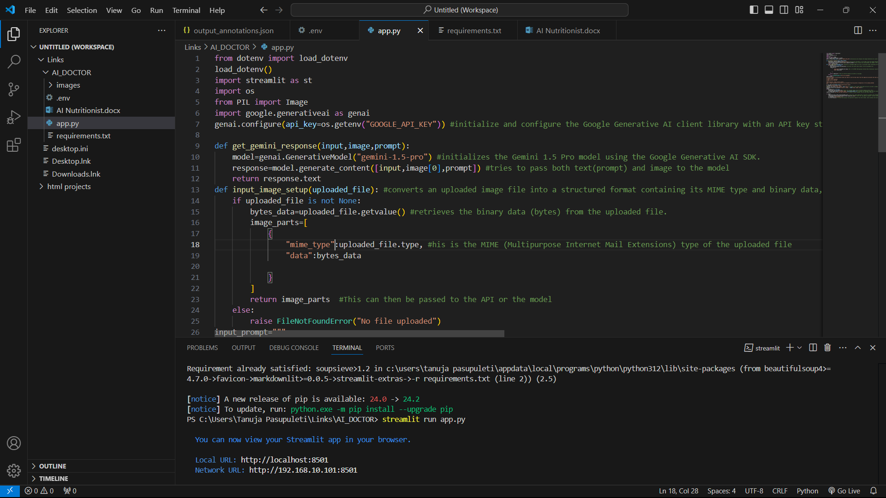
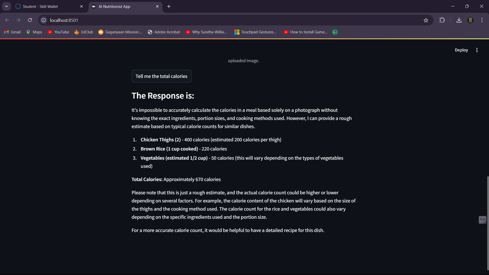
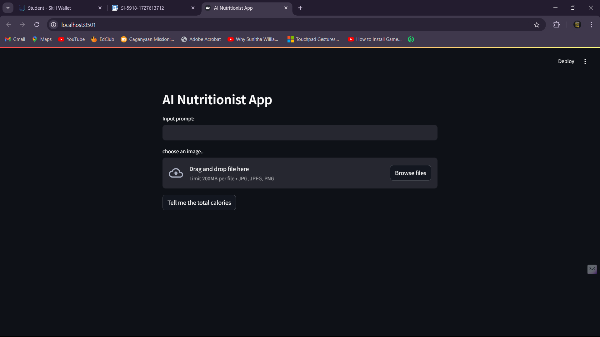
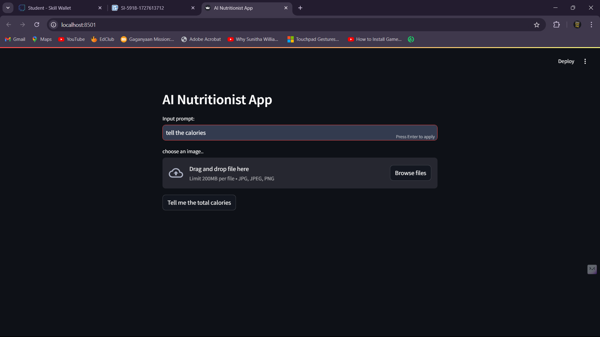
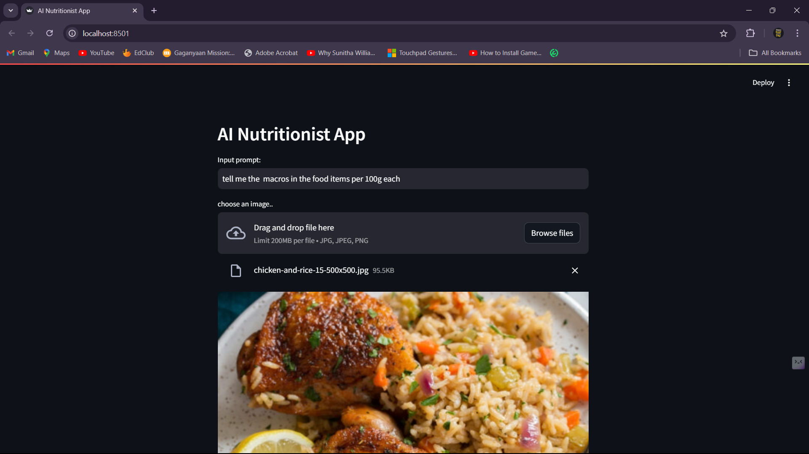
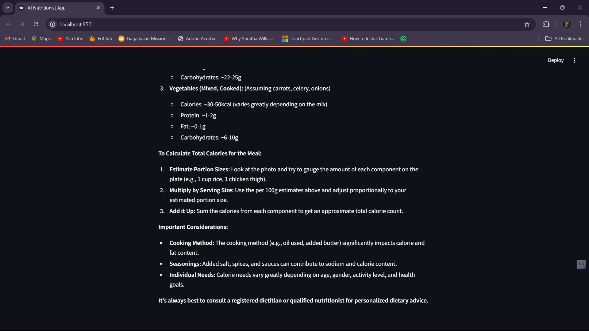

# AI Nutritionist App - Project Documentation

## 1. Introduction

The **AI Nutritionist App** allows users to upload images of food items and calculate the total calories based on the image. The app uses **Google's Generative AI (Gemini)** model to analyze the food in the image and provide detailed calorie information for each item. This app simplifies tracking calorie intake, making it a useful tool for individuals looking to manage their diet.

## 2. Scope

This project aims to build a tool that can estimate calories by recognizing food items from images and calculating the nutritional value. The application allows users to input custom prompts to refine their results.

## 3. Technology Stack

- **Python**: Backend development.
- **Streamlit**: Frontend framework for interactive user interfaces.
- **PIL (Python Imaging Library)**: For image processing.
- **Google Generative AI (Gemini Model)**: To analyze food items in images and generate calorie estimates.
- **dotenv**: For managing environment variables like API keys.

## 4. Installation and Setup

### System Requirements

- Python 3.8+
- A valid Google Generative AI API Key

### Steps to Install

1. Clone the repository:
    ```bash
    git clone https://github.com/Tanuja2024/ai_nutritionist_app.git
    cd ai_nutritionist_app
    ```

2. Install the required Python packages:
    ```bash
    pip install -r requirements.txt
    ```

3. Set up environment variables:
    - Create a `.env` file in the root directory and add your API key:
      ```bash
      GOOGLE_API_KEY=your-google-api-key
      ```

### Running the Application

1. Launch the app using Streamlit:
    ```bash
    streamlit run app.py
    ```

2. The app will open in your browser at `http://localhost:8501`.

## 5. Features and Functionality

### Key Features

- **Image Upload**: Users can upload food images in `.jpg`, `.jpeg`, or `.png` formats.
- **Calorie Calculation**: The app uses AI to analyze the image and return calorie estimates for each food item.
- **Custom Prompts**: Users can provide additional instructions or questions to tailor the AI-generated response.

### How to Use

1. **Upload an Image**: Click the "Choose an image..." button and upload a picture of your meal.
2. **Input a Custom Prompt** (optional): Provide custom instructions if you want more specific information.
3. **Submit**: Click "Tell me the total calories" to process the image and prompt.
4. **View Results**: The app will display a list of food items with their respective calorie counts and the total calories in the image.

## 6. Architecture/Workflow

### Workflow

1. **Image Upload**: The user uploads an image of food.
2. **AI Processing**: The image and custom prompt (if any) are sent to the Google Generative AI model for analysis.
3. **Calorie Calculation**: The AI model recognizes the food items and calculates the calories.
4. **Results Displayed**: The app displays a detailed list of food items along with their calorie counts.

### High-Level Architecture

- **Frontend**: Built using Streamlit, allowing the user to upload images and view the calorie output.
- **Backend**: Processes the image using Python's `PIL` library and communicates with Google's Generative AI to generate the calorie information.

## 7. API Usage

### Google Generative AI API

The application leverages the **Google Generative AI (Gemini)** API for processing images and generating a response.

- **Endpoint**: `/generate_content`
- **Input**:
  - Image data (in byte format)
  - Optional custom prompt
- **Output**: A structured text response with calorie information for each food item.

### API Key Configuration

The API key is stored in an environment variable using the `.env` file for security. To use the API, you must:
1. Get an API key from Google Cloud.
2. Add it to the `.env` file:
   ```bash
   GOOGLE_API_KEY=your-google-api-key

## Screenshots
 






 

 

 

 


